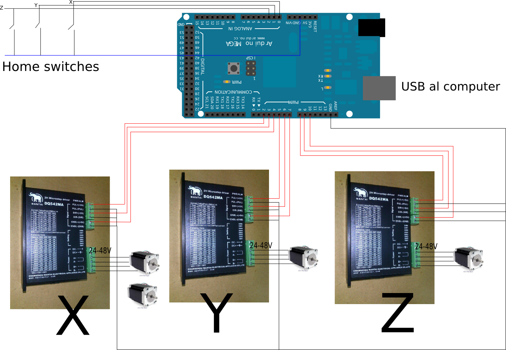

# Marlin3Serial

Nothing fancy nor updated Marlin, but it handles three serial ports (Serial, Serial2 & Serial3) for different purposes.

Please note this code breaks many of the usual pinout on RAMPS boards.

